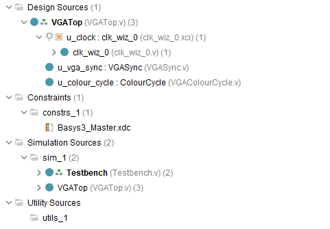
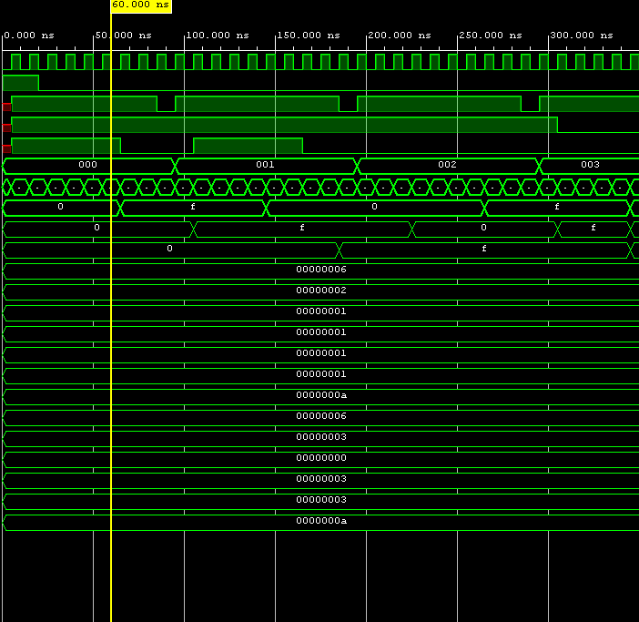
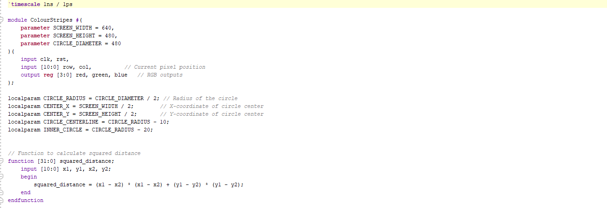
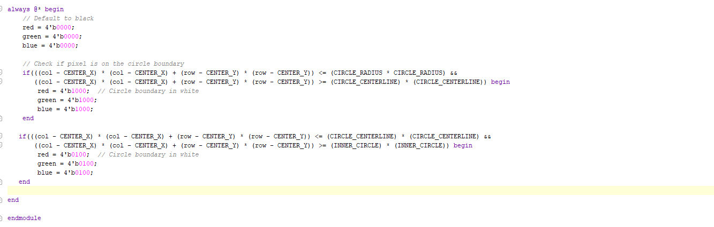
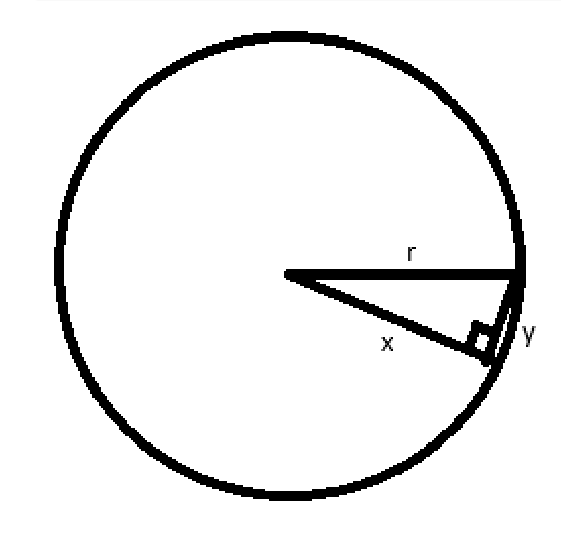

Welcome to my FPGA VGA Driver Project. For this project I tried to design and implement a "Mercedes Benz Logo" display using Verilog, demonstrating the use of geometric shapes like circles and triangles on an FPGA-driven VGA Display.

## **Template VGA Design**
### **Project Set-Up**

This project was developed using the Basys3 FPGA development board and Vivado design software. The setup includes creating a VGA driver capable of rendering pixels on a 640x480 resolution display. The design flow involved writing Verilog code for pixel generation, simulating the design, synthesizing the hardware description, and implementing it on the Basys3 board. Since this project requires a Basys3 board and Vivado can't work properly with OneDrive, we can only work on this project during the lab time. For each session, I have to make sure i save a copy of my code to prevent any accidents such as code disappearing.

The image below is an example of my Vivado project summary window:

### **Template Code**

1. **VGA Sync Generation**: This module generates the necessary horizontal and vertical synchronization signals to control the VGA display at a resolution of 640x480 pixels.
2. **Pixel Generation**: A simple color pattern (e.g., stripes or a solid background) was generated by controlling the RGB outputs based on pixel positions (`col` and `row`).
   
   

This image above shows all the design sources including VGATop.v, VGASync.v, and VGAColorCyle.v. Now we look into the VGAColorCycle file that contains the code that generates color cycle.

**Color Cycle**

This color cycle code is provided that generates a color cycle design, I used this code to develop some basic understanding of the VGA designs that may help me later on my project.

From this code, we can see that it is using the concept of state machine to perform color cycle action by changing the state, in this case which is the color whenever the counter counts to a specific time count. In the case statement, there are different cases (Black, Red, Yellow, Green...). For each cases, the line color <= will set the color into different binaries that represent different colors, for example black will be 12 "0"s, so on and so for. To perform state transition, it will update the state_next value at the end of each cases.

The VGA interface operates by scanning through each pixel row by row, synchronizing the timing signals to ensure the display is refreshed at 60Hz. A horizontal sync signal (H-Sync) and a vertical sync signal (V-Sync) are generated for proper image display.

### **Simulation**
The simulation process was carried out to verify the pixel positin logic and color outputs. I used the Vivado simulation tool to inspect the waveform of the VGA timing signals (hSync and vSync) and also the pixel color outputs (Red, Green, Blue). This step ensures that the VGA sync signals were correctly generated and pixel values matched expectations, confirm the correct timing and pixel behaviour before implementing the design on hardware.

Here's a screenshot of the waveform showing the synchronization and RGB outputs. 

Unfortunately im the simulation picture, I missed the part on the left saying whats the name of each signal.

**Clock Signal (clk)**

The top one should be clock signal. The waveform shows a consistent 25Mhz clock, which is what I set up in the catalog. This clock drives the VGA synchronization module, which is the VGASync, and ensures the proper timing for pixel scanning on the screen. The reason why it is important is because the VGA display requires precise timing signals to update rows and columns at a refresh rate of 60Hz, this clock will divide the pixel timings into cycles that allign with VGA specifications.

**Synchronization Signals (hSync, vSync)**

**hSync (Horizontal Sync)**

The horizontal sync controls the **Horizontal Scanning** of pixels (from left to right across each row). This signal alternates between **high** and **low** to indicate the end of each row.

**vSync (Vertical Sync)**

This signal controls the **Vertical Scanning** of rows (from top to bottom across the screen). This is similar to **hSync**, it alternates between **high** and **low** to mark the end of a frame.

**Row and Column Counters (row and col)**

**Row**

This represents the current vertical posiition of the pixel being drawn on the screen, in this case 480 will be 0 to 479.

**Column** 

This represents the current horizontal posiiton of the pixel being drawn on the screen , 640 pixels will be 0 to 639.

### **Synthesis**
After running the simulation, it then will proceed to the next step, which is the synthesis. Synthesis maps the code to a library of signal gates available. The synthesis report shows the resource utilization for my updated design. After that it will proceed to implementation where it confirms that the design fits within the FPGA's constraints and timing requirements.

## **My VGA Design Edit**
So for my VGA design, initially I came up with an idea of making a Mercedes Benz Logo, as I am a big fan of Mercedes and also with the knowledge of geometry such as drawing circle and triangle using mathematical formula. So the mercedes logo can be break down into two parts, one is the ring outside and inside will be three triangle that is on 0 degree, 120 and 240 degrees around the center point of the ring. This will be a still image, so from the code template, I won't be needing the state machine and the counter to switch between states. Instead, i only need mathematical calculation for different shapes and also the color of the shapes to draw this logo.
### **Code Adaptation**

As I said my plan was to design a Mercedes Benz Logo, but then the result is kind of disappointing, for some reason when I was trying to draw the triangle it won't work. But I have the calculation and the concept of drawing the triangle which I will later explain further in my blog.

**The code below is my full code for the design**

**Ring**

First of I set the screen width and screen height as 640 and 480, which matches the display resolution. Then I let the circle diameter as 480 pixels, which is the height of the screen. This will make the ring size fit the vertical height of the screen height, since the screen is rather wide (width > height), so I don't have to worry about the width of the circle as it will always be within the max width of the display. 

Since I am doing a still image, I won't be needing the register for the color red green blue, so instead of red_reg, green_reg and blue_reg, I changed them into just red, green and blue.

Next up is to draw the circle. First I have to set the center point of the circle to (SCREEN_WIDTH / 2, SCREEN_HEIGHT / 2), which will be (320, 240) that locates at the center of the screen. After that will be the radius of the circle, This is crucial as it is required further on for drawing the circle. The value of the radius is simply just diameter / 2. I also added two parameters which is the centerline and the innercircle, the reason why I added these two is to draw another small circle inside that looks like the **shade** of the ring. By adding centerline and innercircle, the big ring will be ranging from centerline to circle radius, and the shade ring will be ranging from inner circle to centerline, the centerline is the line where the two circle connects, and two of the rings will share the same width. 

**The image below shows the ring of the logo**

To draw the ring, I used ChatGPT to study about the circle and come up with an idea of using the equation of triangle, which is **$x^2 + y^2 = r^2$**. The X and Y represents the X and Y axis of a right-angled triangle, the r will then be the hypotenuse of the triangle. 

**The image below gives a better visualization of the formula**

### **Simulation**
Show how you simulated your own design. Are there any things to note? Demonstrate your understanding. Add a screenshot. Guideline: 1-2 short paragraphs.
### **Synthesis**
Describe the synthesis & implementation outputs for your design, are there any differences to that of the original design? Guideline 1-2 short paragraphs.
### **Demonstration**
If you get your own design working on the Basys3 board, take a picture! Guideline: 1-2 sentences.

## **More Markdown Basics**
This is a paragraph. Add an empty line to start a new paragraph.

Font can be emphasised as *Italic* or **Bold**.

Code can be highlighted by using `backticks`.

Hyperlinks look like this: [GitHub Help](https://help.github.com/).

A bullet list can be rendered as follows:
- vectors
- algorithms
- iterators

Images can be added by uploading them to the repository in a /docs/assets/images folder, and then rendering using HTML via githubusercontent.com as shown in the example below.

